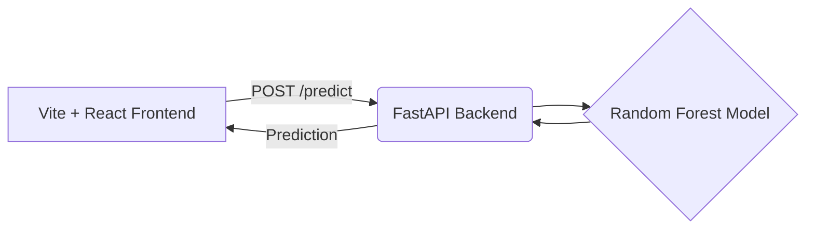

# End-to-End Unemployment Analysis ML Project

Welcome to the AI-powered economic forecasting system for Indian regions. This project transforms a simple exploratory data analysis notebook into a complete, full-stack Machine Learning application. 

It predicts the **Estimated Unemployment Rate** based on regions and economic indicators.

## Architecture



## Features

- **Machine Learning Pipeline**: Data preprocessing, feature engineering, and a Random Forest Regressor trained on Indian unemployment data.
- **FastAPI Backend**: A high-performance REST API to serve predictions.
- **Modern React Frontend**: Built with Vite, featuring glassmorphism, smooth animations, and a sleek dark theme.
- **Dockerized Environment**: Run the entire stack easily using `docker-compose`.

## Getting Started

### Prerequisites

- Docker and Docker Compose installed on your system.

### Running the Application

1. **Clone the repository** (if you haven't already):
   ```bash
   git clone <repository_url>
   cd Unemployment-Analysis-with-Python
   ```

2. **Run with Docker Compose**:
   ```bash
   docker-compose up --build
   ```

3. **Access the application**:
   - Frontend Web App: [http://localhost:5173](http://localhost:5173)
   - Backend API Docs (Swagger): [http://localhost:8000/docs](http://localhost:8000/docs)

### Local Setup (Without Docker)

1. **Train the Model**:
   ```bash
   pip install -r requirements.txt
   python model_training.py
   ```

2. **Start the Backend**:
   ```bash
   uvicorn backend.main:app --reload
   ```

3. **Start the Frontend**:
   ```bash
   cd frontend
   npm install
   npm run dev
   ```

## Technologies Used

- **Python**: Pandas, Scikit-Learn
- **Backend**: FastAPI, Uvicorn, Pydantic
- **Frontend**: React, Vite, Vanilla CSS
- **DevOps**: Docker, Docker Compose

## License

This project is licensed under the MIT License.
